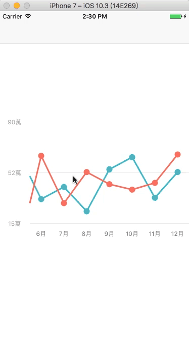
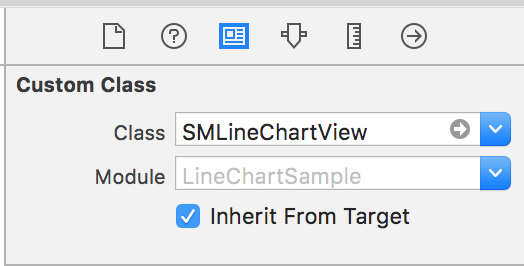
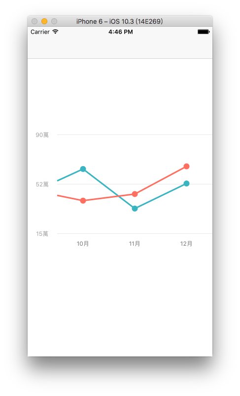
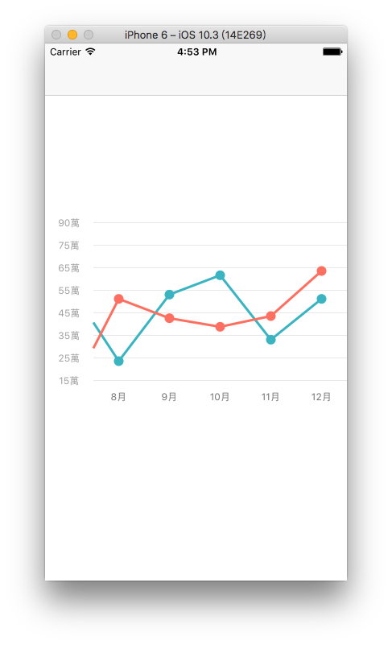

# SMLineChart
LineChart for Swift.


[](http://mit-license.org)




##Usage
###1.Drag the 'SMLineChartView' to your project.
###2.Create a UIView on storyboard or xib.
###3.Setting the class of UIView for 'SMLineChartView'

###4.Setting TagView:


##Usage
```swift
var xList : [String] = []
    
for i in 1...12 {
    xList.append("\(i)月")
}
    
// 1.setting
self.m_lineChartView.setXaxisStringList(list: xList, maxDisplay: 7) // required
self.m_lineChartView.setYaxisStringList(maximum: 90, minimum: 15, count: 3) // required
self.m_lineChartView.setDotRadius(6.0) // optional
self.m_lineChartView.setScrollingSensitive(100) // optional
self.m_lineChartView.setYaxisUnit(titleUnit: "萬")
// 2.submit.
self.m_lineChartView.setupChart()
    
// 3.add line.
self.m_lineChartView.addLine([52,60,59,69,50,33,42,24,55,64,34,53], color: UIColor(red: 68/255, green: 188/255, blue: 201/255, alpha: 1.0))
self.m_lineChartView.addLine([44,20,45,60,30,65,30,53,44,40,45,66], color: UIColor(red: 253/255, green: 123/255, blue: 107/255, alpha: 1.0))

```

you can set the maxDisplay and yAxisLabel count.

for example :

if you setting like this :

```swift
self.m_lineChartView.setXaxisStringList(list: xList, maxDisplay: 3) 
self.m_lineChartView.setYaxisStringList(maximum: 90, minimum: 15, count: 3)

```
you will get :




and if you setting like this :

```swift
self.m_lineChartView.setXaxisStringList(list: xList, maxDisplay: 5)
self.m_lineChartView.setYaxisStringList(maximum: 90, minimum: 15, count: 8)

```
you will get :



